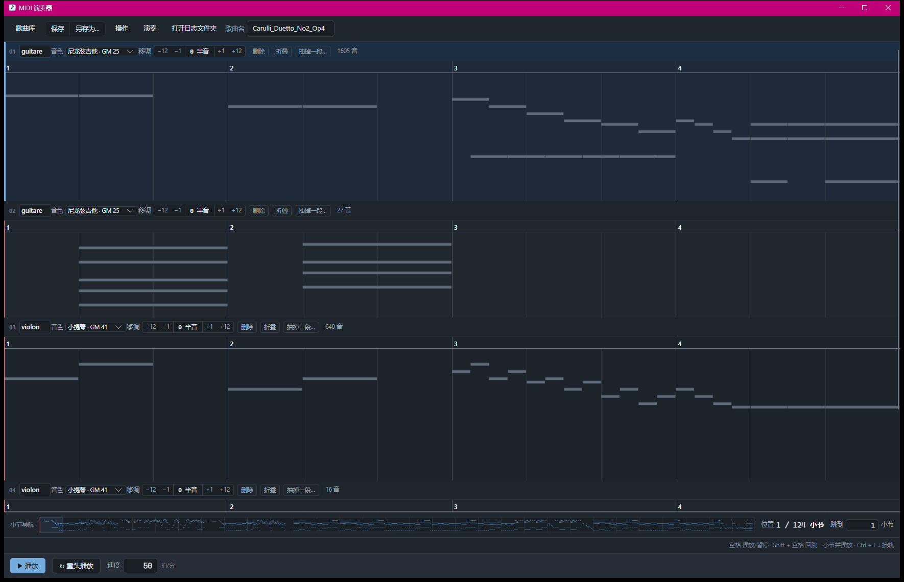
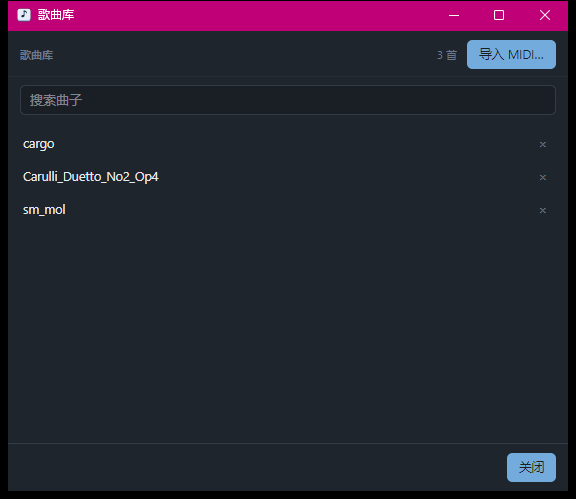
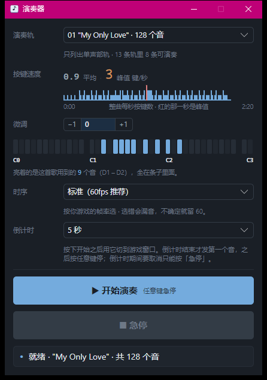

# MidiPerformer

让电脑替你把手按下去喵 —— 读一份 MIDI，按谱面合成键盘事件，发给正在运行的游戏或软件。
Windows 桌面应用：一个编辑器（钢琴卷帘 + 曲库），一个演奏器。

## 它做什么

游戏里的乐器只能一个音一个音地弹，一首完整的曲子，手是真按不下来呀。

而网上下的 MIDI 又是给合成器和音响听的，不是给游戏键盘弹的：轨太多、声部太厚、速度不对、
调也不对。这个程序管的就是中间那一段喵：

**挑一首 MIDI → 改成能弹的样子 → 发成按键。**

- **编辑** —— 卷帘上直接动手喵：拖音符改音高和长短，框选、删除、把一整段连时间抽走、撤销重做，
  整曲改速度，每条轨单独移调和换音色。
- **曲库** —— 一行 `.mid` 就是一首曲子，躺在程序旁边的 `songs\` 目录里。能拷给别人、能用别的
  软件打开、想删就直接删喵。带搜索，哪首改过、哪首弹得动，列表上一眼看得出来。
- **演奏** —— 把选中那条轨编成带时间戳的按键序列发出去，起跑前留几秒倒计时给你切窗口喵。
- **试听** —— 不真发按键，先听一遍。走 Windows 的 MIDI 输出设备喵。

## 界面

编辑器：工具栏、一条轨一行的轨头、堆起来的卷帘，底下三根条子。



曲库：双击打开一首，右上角导入，右边那个 × 送走一首喵。



演奏器：挑一条弹得动的轨，选好倒计时，按下开始就赶紧去切窗口喵 (=^･ω･^=)



## 环境

- Windows 10 / 11，x64。
- 构建要 .NET 8 SDK；发布的单文件 exe 自带运行时，不装 SDK 也能跑喵。

**演奏要管理员权限哦。** 这个不是程序在摆架子 —— Windows 的 UIPI 会把普通进程发出的按键
挡在前台窗口外面，而被挡住的时候**不报错、也不出声**，看起来跟「游戏没反应」一模一样，
能查你半天喵。

不用你手工去提权：程序启动的时候会问你一次要不要以管理员身份重启，**可以拒绝**。
拒绝之后编辑、试听、曲库全都照常，只有「开始演奏」会被挡下来，并且当场告诉你为什么喵。

## 构建与运行

```
dotnet build MidiPerformer.slnx
dotnet run --project MidiPerformer.App
```

发布单文件 exe：

```
pwsh tools/publish.ps1
```

出 win-x64 自包含单文件（裁剪 + 压缩），落在
`MidiPerformer.App\bin\Release\net8.0\win-x64\publish\`。

## 上手

1. 工具栏点**歌曲库**，在曲库窗右上角点**导入 MIDI…**，挑一个 `.mid`，顺手给它起个名字喵。
   也可以直接把文件拖进主窗口。
2. 曲库列表里**双击**那一首。
3. 卷帘上改到你满意：删掉多余的声部、改调、改速度。
4. 点**保存**存回曲库；或者点**另存为…**，写到你挑的任意位置喵。

改完点工具栏的**演奏**，挑一条轨、选好倒计时，按**开始演奏**，然后赶紧切到游戏窗口喵！

## 编辑器

### 工具栏

| 入口 | 干什么 |
| --- | --- |
| 歌曲库 | 开曲库窗口 |
| 保存 | 存回曲库（名字一样就覆盖这一首）。`Ctrl + S` 也认 |
| 另存为… | 写到你挑的任意位置，一个标准 MIDI 文件，不进曲库 |
| 操作 ▾ | 撤销 / 重做 |
| 演奏 | 另开一个窗口，把选中的轨弹到别的程序里去 |
| 打开日志文件夹 | 出事之后要翻痕迹就点它（见「文件都在哪」） |
| 歌曲名 | 回车改名 —— 改名就是改曲库里的文件名；还没进曲库的，回车就存进去 |

有改动没存下来的时候，「保存」那一格会**填上主色** —— 想装作没看见都难喵。

### 卷帘

| 操作 | 效果 |
| --- | --- |
| 拖音符中间 | 改起点、改音高 |
| 拖音符右端 | 改长短，起点钉着不动 |
| 拖音符左端 | 改起点，尾巴钉着不动（长短跟着变） |
| 空白处横向拖 | 框选一片 |
| `← →` | 挪时间（一格 = 十六分音符） |
| `↑ ↓` | 挪音高 |
| `Shift + ← →` | 改长短 |
| `Ctrl + ← →` | 选同轨前 / 后一个音 |
| `Ctrl + ↑ ↓` | 换轨 |
| `Delete` / `Backspace` | 删掉选中的音 |
| `Esc` | 取消选中 |
| `Ctrl + Z` | 撤销 |
| `Ctrl + Y` 或 `Ctrl + Shift + Z` | 重做 |

其实不用背喵 —— 读数条右边那行提示一直在那儿，说的就是你此刻用得上的那几个键。

### 轨头

每条轨一行，从左到右：轨名（点一下能改）、**音色**下拉、**移调**（`−12` / `−1` / `0` / `+1` / `+12` 半音）、
**删除**、**折叠**、**抽掉一段…**，最后是这一轨有多少个音喵。

- **移调**挂在**轨**上，永远不落进音符里 —— 改错了随时改回来，无损喵。
- **折叠**把这条轨收成一行，**试听时不再出声**。谱面一个字节都不动喵。
- **抽掉一段…**把一段**连时间一起抽走**，后面的音自己接上来（不是把音符擦掉了事喵）。
  按下去，到卷帘上横向拖出那一段，再按「抽掉」。只动这条轨，别的轨原地不动。

### 走带与读数

底下最窄的那一条是走带：**▶ 播放** / **↻ 重头播放** / **速度**（拍/分，回车生效）。

| 键 | 效果 |
| --- | --- |
| `空格` | 播放 / 暂停 —— 再按停在原地，再按从那儿接着放 |
| `Shift + 空格` | 回跳一小节，接着放 |

走带上面还有两行喵：

- **小节导航条** —— 一条**整曲缩略图**，哪里密、哪里空、播放头在哪儿，一眼扫完；
  右边是**位置**（播放头在第几小节）和**跳到**第几小节。
- **读数条** —— 左边是选中那个音的**轨 / 音高 / 小节 / 拍位 / 时值**，没选中就整块藏起来；
  右边那行提示说的永远是你此刻用得上的那几个键。

音符**只存 tick、不存秒** —— 所以改速度只动速度表里的一个数，几万个音符一个字节都不用碰喵。

## 曲库

曲库就是 **exe 旁边那个 `songs\` 目录** —— 一首曲子一个 `.mid`，没有别的格式、没有数据库喵。
想拷给别人、想用别的软件打开、想备份，都是普通得不能再普通的文件操作。

- **搜索框**边打边筛，回车都省了喵。
- **双击**打开一首；单击只是选中。上下键浏览，回车打开。右边那个 × 送走一首。

每首右边那格小字说的是**这首歌的状态**，一共四种：

| 那一格 | 意思 |
| --- | --- |
| 空的 | 本程序没给它存过盘。从别处手拷进来的 `.mid` 就是这样 —— 不认识就不装认识 |
| 可播放 / 不可播放 | 上次保存时算的：有没有弹得动的轨 |
| 编辑过 · 可播放 | 上次存盘那一刻，它跟打开时不一样 |
| 读不出来（红字） | 缓存文件在那儿，可程序读不懂了 |

曲库目录里还躺着一个 `songs\.work\`，装的是程序给每首曲子存的缓存（`.mproj`）：
它跟着保存一起写，**不是你的曲子本身**。整个删掉也没关系喵 —— 只是「编辑过 / 可播放」
这些标记会跟着没掉，下次打开重新读一遍 `.mid` 就是了。

## 演奏器

工具栏点**演奏**弹出来，独立置顶小窗喵。

### 演奏轨

下拉框**只列出弹得动的轨**：有音的、单声部的、不带打击乐的。游戏里的乐器一次只能响一个音，
多声部轨发出去就是一坨糊音，所以空轨、多声部轨、打击乐轨一个都不往这儿摆喵。
一条能弹的都没有的话，它会告诉你为什么，再给一个「去编辑器…」把你送回去删声部。

### 三块读数

三块都在你按下开始之前就算完了 —— 不用等弹起来才知道这首能不能弹喵。

- **按键速度** —— 平均与峰值（键/秒），外加一条每秒直方图。最密的那一秒在哪儿，一眼看得出来。
- **微调** —— 整首歌升高或降低一个半音，`−1` / `0` / `+1`。
- **音高范围** —— 一条 38 格的键盘图，亮着的是这首歌**用到**的那些音。有音掉在条子外面，
  它会单独喊一声：那些音游戏弹不出来喵。

### 时序与倒计时

- **时序**两档：**标准（60fps 推荐）** 和 **稳健（30fps / 卡顿）**。
  照你游戏的帧率选 —— 选错会漏音，拿不准就留 60 喵。
- **倒计时** 3 / 5 / 10 秒。按下开始，这几秒就是留给你切窗口的；倒计时走完才发第一个音喵。

### 开始之后

按下**开始演奏**那一刻，窗口**自己最小化** —— 那几秒是留给你切窗口的，不是留给你看它的喵。

演奏中屏幕上有块悬浮层，显示进度和当前这个音。想停就按**任意键**（修饰键不算喵），
也可以回到演奏器窗口按**急停**。只有倒计时那几秒不认任意键（那正是你在切窗口的时候），
这时候要反悔，只能按「急停」喵。

### 三种不放行

按了开始却没动静的时候，状态行会说明白是这三种里的哪一种，以及下一步该去改什么喵：

| 不放行 | 为什么 |
| --- | --- |
| 不是管理员 | 发出去的按键会被系统挡在游戏窗口外面 —— 一个音都收不到，还不报错 |
| 输入法是中文态 | 按键会被输入法吃了 |
| 这条轨弹不了 | 游戏乐器一次只响一个音，只能弹单声部、不带打击乐的轨 |

## 文件都在哪

| 东西 | 在哪 |
| --- | --- |
| 曲库 | **exe 旁边的 `songs\`**，一首一个 `.mid`。它不进仓库 —— 删 `bin` 之前先把它挪出来 |
| 缓存 | `songs\.work\<名字>.mproj`，整个删掉也没事 |
| 日志 | `%LOCALAPPDATA%\MidiPerformer\logs\`，每次启动写一份，留 7 天、最多 20 份 |

日志是出事之后唯一还能翻的痕迹喵。工具栏那颗**打开日志文件夹**直接把它开出来 ——
它一直亮着，不用先载一首曲子。

## 许可

MIT，见 [LICENSE](LICENSE)。
